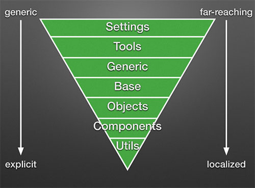
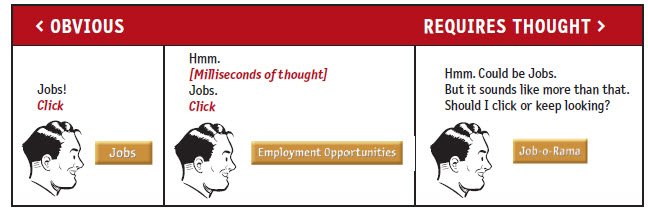
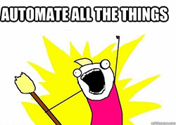
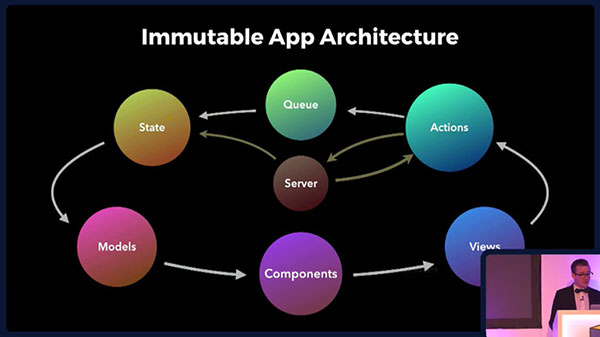
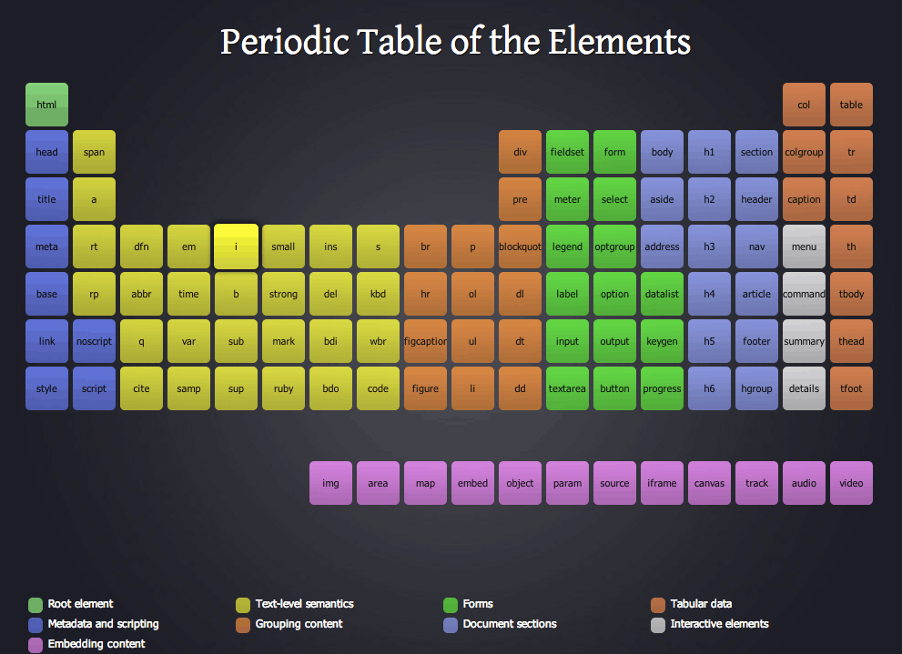

CSS organization
================

The problem we're trying to address here is *how to design an [open-source](https://github.com/reusable-components), reusable component library aiming at building [(living) styleguides](http://styleguides.io/) and design systems*.

*Component library* ?  
→ see [@mikaelsandin's series of articles](https://medium.com/building-a-component-library) for the *City of Gothenburg* as an example.  
*Design systems* ?  
→ see [BBC's Global Experience Language](http://www.bbc.co.uk/gel), [GE’s Predix Design System](https://medium.com/ge-design/ges-predix-design-system-8236d47b0891), etc.

The purpose of the current research at this stage is to detail what would an [ideal](https://en.wikipedia.org/wiki/TRIZ) final result be. Later on, we may move on to analyze concrete options, challenges and compromises. But for now, we'll start with a list of guiding principles in order to expose some basis of the reasoning behind the decision process.

So here's roughly what the methodology presently looks like :
- Distilled from experience, the very nature of existing guidelines and principles already makes them blueprints of and/or pointers to potential solutions.
- The general value and relevance of principles and tools is evaluated with factors related to communicability, developer experience (and of course, fitness for purpose).
- The curation (selection and exclusion) of references or resources involves criterias such as maturity, "history", standard-compliance, portability, and adoption.


## Source code in this repository

The source code included in this repository is generously allowed to be made publicly available under the MIT license by [Chouette - Institut de français](https://www.chouette.net.br/).  
It is meant to provide context in the form of a case study to evaluate and discuss the present research, and it also serves as an example of CSS organization using PostCSS.

### Tools
- [Gulp](http://gulpjs.com/)
- [cssnext](http://cssnext.io/) (collection of [postcss](https://github.com/postcss/postcss) plugins)

### Installation
```
npm install
```

### Usage
```
# Watch (default Gulp task)
gulp
```

## Principles

References :
- @necolas's [HTML semantics and front-end architecture](http://nicolasgallagher.com/about-html-semantics-front-end-architecture/) - namely : preference to use the "multi-class" pattern, more scalable.
- @csswizardry's [CSS Guidelines](http://cssguidelin.es/) - sections _Architectural Principles_, _CSS Selectors_, and _Specificity_ - **methodology** : [applying traditional software engineering to CSS](https://speakerdeck.com/csswizardry/css-for-software-engineers-for-css-developers) (see also this [video conference](https://vimeo.com/140641366)).
- @christianmaioli's [Writing good code: how to reduce the cognitive load of your code](http://chrismm.com/blog/writing-good-code-reduce-the-cognitive-load/)
- @craftui's [The Language of Modular Design](http://alistapart.com/article/language-of-modular-design)
- @snookca's [Considerations in Component Design](https://snook.ca/archives/html_and_css/component-design).
- @mikaelsandin's [Creating components](https://medium.com/building-a-component-library/creating-components-e08ccc632722).

General principles :
- **DRY / Single Source of truth** - warnings : don't DRY if it's repeated coincidentally, just avoid duplicating data in source (repetition in compiled code is fine).
- **Single Responsability** (context encapsulation, composability) : do one thing, and one thing well - break into individual concerns.
- **Separation of concerns** - notably : don't bind JS onto CSS classes
- **Immutability** - the only time to use `!important`
- **Open/Closed principle** : never change anything at its source, always make change via extension - possibly the most useful principle for dealing with other people's code.
- **Orthogonality** : avoid collisions - ex: using proper scoping
- **Moustache Principle** : just because you can, it doesn't mean you should.
- Make it **readable** : work towards having a predictable architecture
- Make it **easy to digest** : concisely explain the reasoning behind a solution (document the *why*, not the *what*)
- **Avoid distraction** : don’t code "your way" - just follow the coding standards. Make your code predictable and easy to read by coding the way people expect.

Component-oriented, modular design principles :
- **Establish a language foundation** : The agreed-upon name determines how the element will be built and encourages consistent usage across the team - *"If you don’t get agreement up front, prepare for more work later."*
- **Depth of Applicability** : number of generations that are affected by a given rule. The further the distance from the parent to the deepest descendent element, the more complex and rigid the HTML structure needs to be for the selectors to work.
- **Component Boundaries** : if the component is more than 3 levels deep, it might be up for breaking apart into smaller components.
- **Shell/Content Pattern** : often, there’s a shell (container), and then the content that goes within that - can be a great way to recognize when to break things down from one larger component into a few smaller components.
- **Repetition is better than the wrong abstraction** : when in doubt, keep components separated (duplication of code) :
    - *Appearance* – If something looks visually very different it’s probably best to create two separate components, even though they might share the same content model.
    - *Purpose* – if two things look visually alike but actually serves different purposes, ask yourself: Are they just coincidentally similar right now? Do you see them develop in different directions over time? If the answer is yes, maybe it better to create two separate components.
    - *Content model* – Do they share the same content model and look similar and have a similar purpose, then maybe you can come up with a more abstract name and merge the two components into one.


## Existing approaches

The organization of CSS in various libraries or frameworks usually aims to avoid common pitfalls of the *cascading* part of CSS in modular design system (i.e. preventing the accidental bleeding of rules).

[@dakotaleemartinez provides an example](https://medium.com/@dakotaleemartinez/keeping-your-css-dry-with-tachyons-bb1c0dc66dce) of a problematic Bootstrap 3 navbar component extension, illustrating some of the pains these approaches aim to ease.

[@ahfarmer's article](http://andrewhfarmer.com/how-to-style-react/) gives a categorization of the tooling available as of 2016/04/16, and [@fat's talk](https://www.youtube.com/watch?v=iniwPUEbPUM) touches upon the origins of CSS, putting its evolution and uses in perspective - along with [@zackbloom's "The Languages Which Almost Became CSS"](https://eager.io/blog/the-languages-which-almost-were-css/).

I find there are 2 types of approaches to "kill the cascade" in CSS :

- Class naming conventions - ex: eCSS, ITCSS, etc (see below).  
Such conventions already allow for implementing robust organization, and for projects that aren't going to need the kind of scaling that eCSS, ITCSS and the like are providing, we still can have the flexibility of a [SMACSS-based approach](https://snook.ca/archives/html_and_css/dealing-with-cascade-specificity), which means either picking classes or child selectors where appropriate - provided any potential "bleed" is at least documented and/or its scope really narrow.   
This is the approach currently favored here, but we may find opportunities for complementary implementations.
- Inlining all or most styles : see [@chriscoyier's recap](https://css-tricks.com/the-debate-around-do-we-even-need-css-anymore/). And if we chose only to use utility classes (see below), [Tachyons](http://tachyons.io/) could also be used this way, and could get along with the naming convention approach above - provided we avoid class naming collisions. [Atomic CSS](http://acss.io/) is probably the most explicit "inline-like" use of CSS classes.  
Some tools even implement their own syntax (compiled to CSS) to achieve more advanced layout features, like [gridstylesheets.org's GSS](https://github.com/gss/engine) (inspired by [Constraint CSS](http://constraints.cs.washington.edu/web/ccss-uwtr.pdf) and [Apple's Visual Format Language](http://gridstylesheets.org/guides/vfl/)).


## Architecture

I'm using the term *architecture* to refer to the conceptual level of organization, and *file structure* its concrete, physical implementation.

The organization of CSS may follow some categorization of styles. There is hardly one unique way of sorting out the styles for all imaginable projects out there, so this has to stay subjective (because a single generic architecture may not always be the most appropriate for projects of different size or nature).

However, following some logic helps in reducing time spent in making "structural" decisions (good architecture = less questions to ask) - here's an illustration of the Inverted Triangle - [ITCSS](https://speakerdeck.com/dafed/managing-css-projects-with-itcss) metaphore :



- **Settings** : global variables, colors, config switches...
- **Tools** : default mixins and functions
- **Generic** : ground-zero / root styles (resets, normalize.css, box-sizing...)
- **Base** : unclassed html elements
- **Objects** : cosmetic-free design patterns (OOCSS, agnostically named)
- **Components** : designed components, chunks of UI (more explicitly named)
- **Utils** or *trumps* : helpers and overrides, only affects one piece of the DOM (usually `!important`)

Looking into what makes an architecture "good", the goal of having *less questions to ask* can be illustrated in one of [Steve Krug's *Don't Make me think*](https://www.sensible.com/dmmt.html) eloquent strip :



Even though this particular illustration describes a hesitation about the [naming](http://martinfowler.com/bliki/TwoHardThings.html) of a button [label](https://uxplanet.org/microcopy-tiny-words-with-a-huge-ux-impact-90140acc6e42), a similar "cost" would be incurred by an architecture (or any set of rules) that would be unclear, or not obvious to the developer. In other words, and especially in a composable, modular system, *"we need to care about one another's scarce cognitive resources"* - see [Kathy Sierra (Serious Pony) keynote](https://www.youtube.com/watch?v=FKTxC9pl-WM).  
Among other factors, *naming things* is part of important architectural decisions, as it can contribute to speed up (or slow down) the understanding, communication, and ultimately, the adoption of a component, pattern, or organization in our case.

*"Remember that no language (aside from a few exceptions) exists in isolation. By evolving and strengthening your design language, you have an opportunity to contribute to the larger language of the web, and to help make it more consistent and coherent for everyone."* - excerpt from [the Language of Modular Design](http://alistapart.com/article/language-of-modular-design).

In an attempt to simplify the general structure of the CSS codebase, and to cut down the time spent thinking about structural decisions (by trying to make things more obvious and *predictable*), another proposition of categorization is explained below.


## File structure

Here are suggestions for organizing CSS files into 3 sub-folders (base, generic, and specific) - each of which can perfectly be further sub-divided into as many sub-categories as necessary. Both folder and file names can be considered categories.  
The *generic* folder may also be used as an "incubator" of potential future abstract, reusable components - suggesting a component "maturation" process.

**Alternative to discuss** :  
Only use 2 main categories, clearly indicating the intent : reusable or not.  
See *naming alternatives* below.

### Centralized, Single CSS folder
Current structure of the source code available as an example in this repository (comes from a Drupal 7 theme).
```
path/to/project/
    └── css/
        ├── base/           <- 1
        │   └── ...
        ├── generic/        <- 2
        │   └── ...
        ├── specific/       <- 3
        │   └── ...
        ├── node_modules/   <- (gitignored deps)
        │   └── ...
        ├── index.css       <- Input (compilation entry point)
        ├── main.css        <- Output (compiled result)
        └── critical.css    <- 4
```

### Modular, Component-oriented structure
Similar to [eCSS file organization (ch.5)](http://ecss.io/chapter5.html), inspired by [@necolas's talk](https://www.youtube.com/watch?v=m0oMHG6ZXvo).
```
path/to/project/front-end-modules/
    ├── node_modules/       <- (gitignored deps)
    │   ├── sanitize.css/
    │   └── ...
    ├── src/
    │   ├── base/               <- 1
    │   │   ├── my-component/   <- *
    │   │   │   └── ...
    │   │   └── ...
    │   ├── generic/            <- 2
    │   │   ├── my-component/   <- *
    │   │   │   └── ...
    │   │   └── ...
    │   └── specific/           <- 3
    │       ├── my-component/   <- *
    │       │   └── ...
    │       └── ...
    ├── dist/
    │   ├── critical.css        <- 4
    │   ├── main.css            <- Output (compiled result)
    │   └── ...
    └── ...
```

### * Individual Components

Our present goal is to progressively publish a growing [library of open-source components](https://github.com/reusable-components), so that other projects can reuse these just like any other NPM package.

One of the main challenge is defining the "boundaries" between components, which can be very subjective - see the *Component Boundaries* and *Shell/Content Pattern* in the *principles* section above.  
Here's some more advice from a javascript perspective : *"[don't overdo components](http://calmm-js.github.io/documentation/training/#/9/3) - Your components should do something substantial. Does it have a non-trivial model ? Is it a combination of elements you use in lots of places ?"*

Regarding file structure, take [@benfrain's (eCSS) example](http://ecss.io/chapter5.html) :
```
shopping-cart-template/
    ├── shopping-cart.html
    ├── shopping-cart.css
    └── shopping-cart.js
```

Now here's another (work in progress) proposition, that would allow transpiling templates for maximum reusability (across various project stacks - e.g. Twig, Jade/Pug, etc.), planned [standard web-components](https://github.com/mateusortiz/webcomponents-the-right-way) support, and integration into existing [living styleguides](https://www.smashingmagazine.com/2015/04/an-in-depth-overview-of-living-style-guide-tools/) techniques :
```
my-component/
    ├── src/
    │   ├── index.css
    │   ├── index.js
    │   ├── index.*                         <- source for transpiling into different tpl formats
    │   └── ...
    ├── dist/
    │   ├── my-component.css
    │   ├── my-component.js
    │   ├── my-component.html               <- standard-compliant Web Component (à la Polymer)
    │   └── tpl/                            <- transpiled template formats (e.g. for CMSes)
    │       ├── jsx/
    │       │   └── my-component.jsx
    │       ├── phptemplate/
    │       │   └── my-component.tpl.php
    │       ├── pug/
    │       │   └── my-component.pug
    │       ├── twig/
    │       │   └── my-component.html.twig
    │       └── ...
    ├── index.html                          <- demo, static HTML (e.g. for living styleguides)
    ├── README.md                           <- usage, building, contributing instructions, etc.
    ├── package.json
    └── ...
```

Transpiling templates aims at achieving some degree of **interoperability** (across different types of projects - e.g. Drupal, Wordpress, NodeJS) for these components. Automation that code generators like [generator-suit](https://github.com/suitcss/generator-suit) provide could, for instance :
- produce templates (and/or assets) directly inside current project sources (alternative : standalone or framework-specific "bridges", like @JohnAlbin's [Component Libraries](https://www.drupal.org/project/components) for Drupal 8)
- avoid the need to compile from any single particular source format, by designing transpiler to accept different formats as input. Or, attempt to reuse existing [standards](https://xkcd.com/927/) (e.g. @mikaelsandin's use of [XML, XSD and XSL](https://medium.com/building-a-component-library/an-overview-of-the-component-framework-architecture-9ef83d7ebe65), [CSS modules in HTML](https://github.com/maltsev/posthtml-css-modules) / [Pug (ex-Jade) templates CSS Modules integration](https://github.com/css-modules/postcss-modules)...) ~ standard HTML5 could be considered (possibly using custom attributes for use by transpilers which could then be removed in compiled templates, and/or "guessing" variables ?)
- handle backward-compatibility ?



About the **wiring** or *bridging* of data structure, variable names, objects ~ in other words, model → view correspondance (+ "hydration" ?) :  
There seems to be some consensus in this discussion about Drupal's ongoing evolution of front-end implementations ([Component-based rendering](https://www.drupal.org/node/2702061)) around the concept of *Presenter* (from the [MVP](https://en.wikipedia.org/wiki/Model%E2%80%93view%E2%80%93presenter) design pattern) - essentially, a transformation that prepares data for placement in markup (HTML) by correspondance (translation).  
This is described in @wimleers's [comment 51](https://www.drupal.org/node/2702061#comment-11200749) as : *"ensuring that components can be Angular, Ember, whatever components - that the inputs a presenter passes on to components are serializable (into JSON)"* + [comment 55](https://www.drupal.org/node/2702061#comment-11296041) : *"Make components non-Drupal-specific AKA implement what John Albin describes in [30](https://www.drupal.org/node/2702061#comment-11133841)"*.  
→ @JohnAlbin's proposition to *avoid tying the data variable name to the HTML display* depends on a feature of Twig (`embed`, `block` / `include` ... `with` - which also exists in Pug/ex-Jade : `extend`, `block` / `append`) :
- define a set of common variable names used in all reusable, abstract components (ex: `modifier_class`) - TODO : elaborate on Drupal's *Paragraphs* entities with the *Shell / Content* pattern to orient the standardization of a common *language* (e.g. exact same variable names across different technologies ?)
- create an "intermediary" template handling the correspondance, essentially maintaining *two separate groups of Twig files* - a.k.a : the **dual-Twig method** - TODO : elaborate on Pug/ex-Jade equivalence ?

To take a bit further this promising lead, our "ideal solution" pursuit would also aim to be applicable in different contexts - i.e. architectures such as [CALMM.js's ~ maintaining consistent state in the face of async inputs](http://calmm-js.github.io/documentation/training/#/2) and ["Immutable App"](https://vimeo.com/album/3953264/video/166790294) :



About **documentation**, here are some guidelines for individual components, to include in `index.html` and/or `README.md` (in file structure above) :
- A short summary the describes the purpose of the component (document the *why*)
- Dependencies (e.g. to CSS, javascript, icons, images...) - note : dependencies to already packaged / released components would reside in `package.json` to be handled by NPM
- Examples of how to use the component

TODO : list a few Living Styleguides tools and quick setup / getting started instructions here.  
TODO : elaborate on approaches to *extend* components e.g. how to handle *variation* and *combination*.  
TODO : variables, parameters, attributes : evaluate the feasability of abstracting templates.  
TODO : mix in javascript components - look into recent developments in JS architecture, e.g. [Immutable App Architecture](https://vimeo.com/album/3953264/video/166790294) - because they are fundamental structural choices about front-end implementations. Specifically, verify if the relationships between models and views have an impact on the decisions about the "boundaries" of CSS components (ideally, they shouldn't), and wether it matters at all (ideally, it shouldn't).

#### Terminology
- modules : sometimes used to refer to individual components.
- components : designate any reusable, modular, differenciable fragment or pattern of the interface.
- (design) pattern : traditional software engineering principle, sometimes used for meaning UI design pattern.
- UI design pattern : user interface components or interaction patterns.

#### Roadmap
- Make an alternative to [Axure](http://www.axure.com/) tailored to that kind of design system, for ex. based on [Electron](https://github.com/sindresorhus/awesome-electron) (see also [Photon](https://github.com/connors/photon))
- Look into [Slush](http://slushjs.github.io/) or [Yeoman](http://yeoman.io/) for boilerplate automation
- Elaborate on [Element Queries](http://www.jonathantneal.com/blog/thoughts-on-media-queries-for-elements/), essentially adjusting elements to their container instead of the entire viewport, which makes more sense in a modular, component-oriented system. See @marcj's [css-element-queries](https://github.com/marcj/css-element-queries) and [elementqueries.com](http://elementqueries.com/).


## Categorization


### 1. `base/`

Corresponds to :
- [SMACSS category](http://snook.ca/archives/html_and_css/avoid-overstyling-base-styles) : **Base styles**
- [ITCSS](https://github.com/itcss/itcss-netmag/tree/master/css) layers 1, 3, 4 :
    - **Settings** global variables, colors, config switches...
    - **Generic** ground-zero / root styles (resets, normalize.css, box-sizing...)
    - **Base** unclassed html elements
- **Atoms** in @bradfrost's atomic design system terminology

Some base styles are likely specific to the current project, sucha as typographic settings, default tags appearance, colors, etc. - which is why it's been separated from the reusable, generic category (see below).  
TODO : should we follow the "is reusable" logic, and move generic resets like *normalize.css* into the next category ?

File naming (sub-categories) :



- use categories from [Josh Duck’s HTML Periodic Table](http://smm.zoomquiet.io/data/20110511083224/index.html) (see [screenshot](http://bradfrost.com/wp-content/uploads/2012/11/Screen-Shot-2012-11-13-at-5.15.05-PM.png) pictured above) :
    - `base/_root.css` : `html` and `:root` (global) styles
    - `base/_sections.css` : sectionning
    - `base/_grouping.css` : grouping
    - `base/_table.css` : tabular data
    - `base/_text.css` : text-level semantics
    - `base/_form.css` : inputs and forms
    - `base/_embedding.css` : embedding content, media
    - `base/_interactive.css` : `menu`, `details`, `command`, `summary` tags
- [optional] use double extension `.vars.css` for files containing "low-level", global variables (settings) - ex: `base/_typography.vars.css`, `base/_colors.vars.css`, `base/_zindex.vars.css`.

Additional considerations :
- @jonathantneal's [Sanitize.css](https://github.com/10up/sanitize.css) or @necolas's [Normalize](https://github.com/necolas/normalize.css/)
- @mrmrs_'s [tachyons-box-sizing](https://github.com/tachyons-css/tachyons-box-sizing)
- Bits and pieces to adapt from @paulrobertlloyd's [Barebones](https://github.com/paulrobertlloyd/barebones)
- https://milligram.github.io/, https://github.com/matejlatin/Gutenberg, etc.


### 2. `generic/`

Corresponds to :
- [SMACSS categories](https://smacss.com/book/categorizing) : **Layout**, **Module**, **State**
- [ITCSS](https://github.com/itcss/itcss-netmag/tree/master/css) layers 2, 5, 6, 7 :
    - **Tools** : default mixins and functions
    - **Objects** : cosmetic-free design patterns (OOCSS, agnostically named)
    - **Components** : designed components, chunks of UI (more explicitly named)
    - **Utils** or *trumps* : helpers and overrides, only affects one piece of the DOM (usually `!important`)
- **Molecules**, **Organisms** in @bradfrost's atomic design system terminology

Styles with potential for reuse. Utlimately, these would end up forming third-party dependencies (e.g. packaged `node_modules`), but in this folder we may start work-in-progress components, which reusability could then be evaluated in several projects before deciding to make a release out of it.

Naming alternatives to discuss :
- `reusable/`
- `abstract/`
- `patterns/` (or `ui-patterns/`)

Examples of styles belonging in this category :
- SUIT CSS [components-flex-embed](https://github.com/suitcss/components-flex-embed), [components-arrange](https://github.com/suitcss/components-arrange), etc.
- @mrmrs_'s [colors](https://github.com/mrmrs/colors)
- Any individual or isolated unit of styles that can be reused from other frameworks ([Tapestry](http://tapestry.wisembly.com/components), [InuitCSS](https://github.com/inuitcss), [Material Design Lite Components](https://github.com/google/material-design-lite), [PureCSS](http://purecss.io/), [BassCSS](http://www.basscss.com/), [Layers CSS](http://eiskis.net/layers/), [cssrecipes](https://cssrecipes.github.io/), or even some [Zurb Foundation](https://github.com/zurb/foundation-sites) and [Bootstrap](https://github.com/twbs/bootstrap/) components)

TODO : define groundwork ? e.g. [some](https://robinrendle.com/essays/new-web-typography/) [typographic](https://viljamis.com/2016/typography-for-user-interfaces/) [design](http://lawsofsimplicity.com/) [best](http://utility-opentype.kennethormandy.com/) [practices](https://ia.net/know-how/responsive-typography-the-basics) & [grid](http://www.thinkingwithtype.com/contents/grid/) [systems](http://thegridsystem.net/), [accessible](https://developer.mozilla.org/en-US/docs/Web/Accessibility/ARIA) - [universal](https://adactio.com/journal/10665) - [progressively enhanced](https://www.filamentgroup.com/lab/enhancing-optimistically.html) design...  
TODO : evaluate [CSS Modules](http://glenmaddern.com/articles/css-modules).


### 3. `specific/`

Corresponds to any of the `generic/` category, plus :
- [SMACSS category](https://smacss.com/book/categorizing) : **Theme**
- **Templates** and **Pages** in @bradfrost's atomic design system terminology

Low potential for reuse, but these styles shouldn't necessarily be unstructured either.

Naming alternatives to discuss :
- `project/`
- `current/` (or `current-project/`)

Within that folder, the organization should accomodate the size of the current project, and/or personal preference - ex : transposing @HugoGiraudel's [Architecture for a Sass Project](http://www.sitepoint.com/architecture-sass-project/)
Examples :
- Variables overrides (media queries values, objects and utilities customizations, etc.)
- Variations, extensions of objects ("specialization" of generic styles)
- *Theme* modifiers (as in @csswizardry's namespace terminology)
- Custom components


### 4. `critical.css`

Experimental / to discuss :
This file is the result of a separate compilation, taking any CSS file ending with `.critical.css` (double extension), and optionally (TODO : compilation options) folders like `base/` or `generic/` (as the main layout and typography are usually abstracted - like grids, widths, box-model measures or scales).
Alternative tool to generate this file : @filamentgroup's [criticalCSS](https://github.com/filamentgroup/criticalCSS)
More info :
- @adactio's [Inlining critical CSS for first-time visits](https://adactio.com/journal/8504)
- @filamentgroup's [How we make RWD sites load fast as heck](https://www.filamentgroup.com/lab/performance-rwd.html)
- @chriscoyier's [Authoring Critical Above-the-Fold CSS](https://css-tricks.com/authoring-critical-fold-css/)


## CSS Coding Style and Naming Conventions

- All imported CSS files should have the `_` prefix in their filename.
- File naming convention may also follow [InuitCSS's file naming conventions](https://github.com/inuitcss/getting-started) or [ITCSS](http://itcss.io/) - see [example](https://github.com/itcss/itcss-netmag/tree/master/css)).
- General coding style and selectors may use ANY of the following conventions, as long as it helps enforcing the principles outlined in the methodology (see also *Linting* section below) :
    - [Principles of writing consistent, idiomatic CSS](https://github.com/necolas/idiomatic-css),
    - [SUIT CSS naming convention](https://github.com/suitcss/suit/blob/master/doc/naming-conventions.md),
    - @csswizardry's [Namespaces](http://csswizardry.com/2015/03/more-transparent-ui-code-with-namespaces/) (see [BEMIT](http://csswizardry.com/2015/08/bemit-taking-the-bem-naming-convention-a-step-further/) and @DaveOrDead's [Additional Tips](https://www.smashingmagazine.com/2016/06/battling-bem-extended-edition-common-problems-and-how-to-avoid-them/)),
    - [Enduring CSS (eCSS)](http://ecss.io/),
    - [Tapestry](https://github.com/Wisembly/tapestry),
    - etc.
- Additional namespaces (custom class prefixes) suggestions :
    - `fx-` : effects or interactions
    - `b-` : box-model utilities : borders
    - `m-` : box-model utilities : margins
    - `p-` : box-model utilities : paddings
    - `c-` : custom component (not reusable) - to discuss : use PascalCase for reusable components only ?
- (to discuss) Double extension `.critical.css` for separate inline "critical" CSS compilation ?
- Encourage [Meaningful Whitespace](http://cssguidelin.es/#meaningful-whitespace)
- Components :
    - Consider additional namespace by vendor/author for portability (e.g. `fx-paulmicha-foobar`)
    - And/or implement dynamic prefixes with tools like [postcss-class-prefix](https://github.com/thompsongl/postcss-class-prefix) or [CSS Modules](https://github.com/css-modules/css-modules)
- T-shirt sizes : common suffixes to indicate size or magnitude. Example : see file [`_typography.vars.css`](base/_typography.vars.css).
- Color variable aliases : allows for safer ulterior modifications, by separating declaration (changing value) from application (changing usage). Example : see file [`_colors.vars.css`](base/_colors.vars.css) and file [`_root.css`](base/_root.css).
On colors, see also [clrs.cc](http://clrs.cc/) and [accessible color combinations (contrasts) examples](http://clrs.cc/a11y/).


## Linting

The choice not to enforce any particular selectors naming convention does not necessarily mean linting can't be done : it could test for obvious violations of the principles of the methodology (TODO : list a few implementations that could be combined without conflict).

It's worth noting that CSS Modules seem to have a similar stance : [*"For local class names camelCase naming is recommended, but not enforced."*](https://github.com/css-modules/css-modules)


## Regression Testing

See [@justin_tulloss's Building Accurate Visual Diffs](https://blog.spotbot.qa/building-accurate-visual-diffs-6b41b09973a6).

Here are a few tools that got my attention over the last few years :
- [BackstopJS](https://css-tricks.com/automating-css-regression-testing/)
- [Shoov.io](http://www.gizra.com/content/shoov-ui-regression/)
- [Spectre](https://medium.com/friday-people/how-we-do-visual-regression-testing-af63fa8b8eb1)

TODO : summarize quick setup instructions here.
